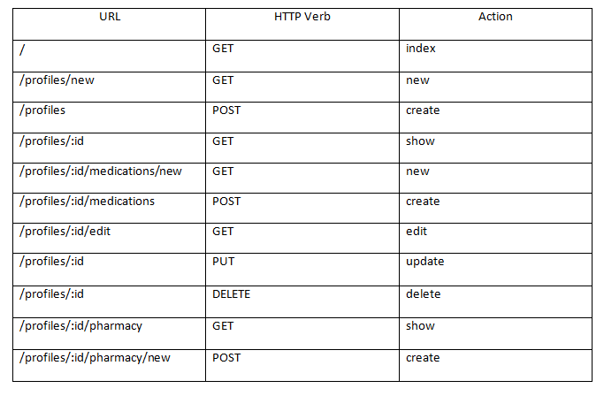
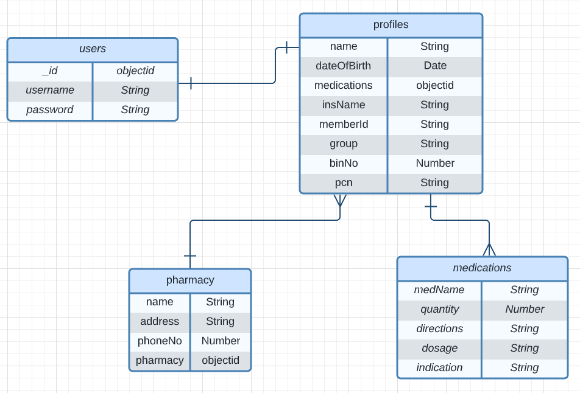

# Medication Tracker Full-Stack Application

## OVERVIEW

Medication tracker to help those on multiple medication regimens manage theirs or their loved one's medications. Tracker will allow user to create profiles as well as store insurance card or pharmacy information.

### Link
- TBA

### Technology
- OAuth
- MongoDB
- Mongoose
- Express JS
- Node JS
- HTML5
- CSS & Bootstrap
- JavaScript


## INSTRUCTIONS
- TBA


## RESTFUL CRUD ROUTES




## USER STORIES
```
As a user, I want the ability to...
- create an account
- sign in with a username and password
- sign out
- navigate the app using a navbar
- create profiles
- view all my medications
- add, delete, and edit medications
- add my pharmacy and insurance info
```

## Wireframes/Screenshots


## Entity Relationship Diagram




## Credits
Wireframes and ERD was created using [Lucidchart](https://www.lucidchart.com/).
